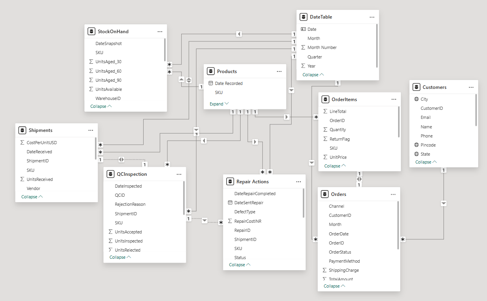

# ⌚ SKMEI Sales & Operations Dashboard – Power BI

## 📊 Project Overview
This Power BI project presents **two interactive dashboards** — one focused on **Sales Performance** and another on **Operations & Inventory Management** for SKMEI watches.  
It provides management-level insights on revenue, stock flow, and operational efficiency.

---

## 🎯 Dashboards Included

### 1️⃣ SKMEI Sales Dashboard 2025
- Total Sales, Orders, and Customers  
- Month-over-Month Sales Growth %  
- Top 5 Best-Selling Products  
- City-wise Customer Distribution  
- Payment Method Split (COD, Card, UPI, NetBanking)  
- New vs Returning Customers Trend  

### 2️⃣ SKMEI Operations Dashboard 2025
- Total Shipments, Repairs, and Stock Available  
- Warehouse-Wise Inventory Overview (Surat, Mumbai, Delhi)  
- Shipment & Repair Status Distribution  
- Inventory Aging Analysis (0–60+ Days)  
- Vendor-Wise Shipment Summary  
- Low Stock Alerts and Failure Reasons  

---

## ⚙️ Tools & Technologies Used
- **Power BI Desktop** – For data modeling and dashboard creation  
- **DAX (Data Analysis Expressions)** – For KPIs and calculated measures  
- **Excel / SQL** – For source data and transformations  

---

## 💡 Key Insights
- Achieved **₹2.77M total sales** with **7.23% MoM growth**  
- Identified top-performing product SKUs driving majority of revenue  
- Maintained **90% on-time delivery rate**  
- SLA compliance at **69.93%** with 422 repairs pending  
- Warehouse stock distributed evenly across 3 regions  

---

## 🧭 Interactive Filters
- Month / Quarter  
- Gender  
- Warehouse  
- Vendor  
- Payment Method  

---

## 🖼️ Visuals Preview

---

## 🧠 Purpose
To deliver a unified view of **sales and operations performance** enabling management to track KPIs, optimize inventory, and improve customer experience.

---

## 📂 Repository Contents
| File | Description |
|------|--------------|
| `SKMEI_Salary_Operations_Dashboard.pbix` | Main Power BI dashboard file |
| `SKMEI_Sales_and_Operations.pdf` | PDF export of visuals |
| `model_sales_and_operations.png` | Power BI data model view |
| `SKMEI_Collection.xlsx` | Web Scrapping and Sample combo dataset used for the dashboard|
| `README.md` | Documentation and project overview |

---

## 🚀 How to Use
1. Clone or download this repository.  
2. Open the `.pbix` file in **Power BI Desktop**.  
3. Refresh or connect your own data source.  
4. Explore the visuals and filters interactively.

---

## 👩‍💼 Author
**Hasti Kakadiya**  
📧 Email: hastikakadiya9@gmail.com  
🌐 LinkedIn: https://www.linkedin.com/in/hasti-kakadiya-383031300/

---

⭐ *If you like this dashboard, consider starring the repository to support more Power BI projects!* ⭐
